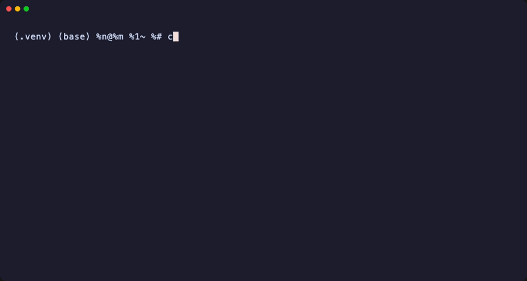

# dotmd-parser

[](https://pypi.org/project/dotmd-parser/)
[](https://pypi.org/project/dotmd-parser/)
[](LICENSE)



> [日本語版 README はこちら](README.ja.md)

Dependency graph parser for `.md` skill files — built for AI agent prompt engineering with [Claude Code](https://docs.anthropic.com/en/docs/claude-code) and similar tools.

## Why dotmd-parser?

As AI agent projects grow, `.md` files start referencing each other via `@include`, `@delegate`, and `@ref` directives. Without tooling, you're left manually tracing dependencies to answer basic questions:

- *"Which files break if I edit `shared/role.md`?"*
- *"Is there a circular reference hiding in my skill tree?"*
- *"What `{{variables}}` are still unresolved after expansion?"*

**dotmd-parser** solves this by parsing your `.md` files into a dependency graph — automatically detecting directives, runtime references, and template placeholders. One function call gives you the full picture.

## Token savings — measured

The single biggest reason to reach for `dotmd-parser` in an agent loop is
that it lets Claude understand a folder **without reading every file**.
The numbers below are produced by `tests/test_token_savings.py` (run
with `DOTMD_TOKEN_REPORT=1 pytest -s`) using `tiktoken`'s `cl100k_base`
encoding (a close proxy for Claude's tokenizer family):

| Folder profile | Files | Naive read of every `.md` | `dotmd-index.md` | `digest` |
|---|---:|---:|---:|---:|
| Small skill (each file ~2 KB) | 4 | 1,610 tokens | **605 (0.38×)** | 174 (0.11×) |
| Medium docs (each file ~2 KB) | 31 | 15,855 tokens | **2,837 (0.18× → 5.6× cheaper)** | 1,285 (0.08×) |
| Large docs (each file ~2 KB) | 111 | 58,171 tokens | **9,535 (0.16× → 6.3× cheaper)** | 4,606 (0.08×) |

**Takeaway**: at ~30 files dotmd-parser already cuts Claude's reading
cost by **~5.6×**, and the savings *grow* with folder size. At 100+
files the same context window now fits **6× more conversation**, or
serves the same prompt at **1/6 the input-token spend**.

The persistent `dotmd-index.md` artifact pays a fixed frontmatter
overhead, so for *very small* folders (a handful of files of a few
hundred bytes) the naive read can still win. The `digest` output is
even more compact (~12× cheaper at scale) but isn't persisted on disk —
use `dotmd-index.md` for stable navigation, `digest` for one-shot
summaries.

The break-even is around **4 files × 1 KB each**: above that,
`dotmd-index.md` is always cheaper than reading the folder by hand.

## Comparison

| Capability | Manual / grep | dotmd-parser |
|---|---|---|
| Find `@include` / `@delegate` / `@ref` references | `grep -r "@include"` — flat list, no context | Structured graph with node types and edge metadata |
| Detect circular references | Hope you notice before the agent loops | Automatic detection with full cycle path in warnings |
| Reverse dependency ("what breaks?") | Manually trace every file | `dependents_of(graph, "shared/role.md")` — one call |
| Expand `@include` to final text | Copy-paste by hand | `resolve("SKILL.md", variables={...})` — recursive expansion |
| Find unresolved `{{variables}}` | `grep "{{" *.md` — noisy, no dedup | Deduplicated list per node and after expansion |
| Missing file detection | Runtime failure | Warnings at parse time with exact paths |
| Detect **implicit** deps (no directives yet) | Read every file, draw by hand | `analyze` subcommand asks Claude, emits `@include` / `deps.yml` |
| Feed Claude Code with compact context | Read 20 files × 5 KB each | `digest` outputs one ~2 KB summary; `.claude/dotmd-index.json` cache |

## Installation

```bash
pip install dotmd-parser
```

## Quick Start

```python
from dotmd_parser import build_graph, resolve, dependents_of, summary
```

### build_graph — Build a dependency graph

```python
graph = build_graph("./my-skill/")
# or from a specific file
graph = build_graph("./my-skill/SKILL.md")
```

Returns:

```json
{
  "nodes": [
    {"id": "/abs/path/to/SKILL.md", "type": "skill", "missing": false, "placeholders": []}
  ],
  "edges": [
    {"from": "...", "to": "...", "type": "include", "parallel": false}
  ],
  "warnings": []
}
```

**Custom node type mapping:**

By default, node types are inferred from path keywords (`agent`, `shared`, `prompt`, `reference`, `asset`, `template`). You can override this with the `type_map` parameter:

```python
graph = build_graph("./my-skill/", type_map=[
    ("helper", "utility"),
    ("core", "foundation"),
])
```

**deps.yml support:**

If a `deps.yml` file exists in the root directory, its dependencies are automatically merged into the graph:

```yaml
- path: agents/planner.md
  includes:
    - shared/role.md
    - shared/tools.md
```

### resolve — Expand @include directives

Recursively expands `@include` directives into final text. `@delegate` and `@ref` lines are left as-is.

```python
result = resolve("./prompts/main.md", variables={"name": "Alice"})

print(result["content"])       # Fully expanded text
print(result["placeholders"])  # Unresolved {{variable}} names
print(result["warnings"])      # Circular refs, missing files, etc.
```

#### Injection scanning

`resolve` scans content pulled in via `@include` for prompt-injection
patterns (role spoofing like `System:`, instruction overrides like "ignore
previous instructions"). Findings print to stderr; the expanded content is
unchanged by default.

```bash
dotmd-parser resolve ./skill/SKILL.md                      # scan on, warn (default)
dotmd-parser resolve ./skill/SKILL.md --no-scan            # disable scanning
dotmd-parser resolve ./skill/SKILL.md --scan-rule tool-exfil   # add an opt-in rule
dotmd-parser resolve ./skill/SKILL.md --block              # replace injected includes with a placeholder
```

The root/entry file is trusted and not scanned — only `@include`-pulled
files are. Matches inside fenced code blocks are ignored, and
`<!-- dotmd-allow: role-spoof -->` (or `all`) in a file suppresses that rule.

### dependents_of — Reverse dependency query

```python
# "If I change shared/role.md, what else breaks?"
affected = dependents_of(graph, "/abs/path/to/shared/role.md")
```

### summary — Human-readable overview

```python
print(summary(graph))
# Nodes: 5  (agent:1, prompt:1, shared:2, skill:1)
# Edges: 4  (include:2, ref:1, read-ref:1)
# Warnings: 0
# Placeholders: name, role
```

## Supported Directives

| Directive | Edge type | Expanded by `resolve()`? | Description |
|---|---|---|---|
| `@include path/to/file.md` | `include` | Yes | Inline expansion — file content is inserted at this position |
| `@delegate path/to/agent.md` | `delegate` | No | Agent delegation — recorded in graph, left as-is in output |
| `@delegate path/to/agent.md --parallel` | `delegate` | No | Parallel delegation with `--parallel` flag |
| `@ref path/to/file.md` | `ref` | No | Runtime reference — recorded in graph, left as-is in output |
| `` Read `path/to/file.md` `` | `read-ref` | No | Legacy runtime reference (same as `@ref`, kept for backward compatibility) |

## Utility Functions

Lower-level parsing functions are also exported for custom use:

```python
from dotmd_parser import parse_directives, parse_read_refs, parse_placeholders, parse_deps_yml
```

| Function | Description |
|---|---|
| `parse_directives(content)` | Extract `@include` / `@delegate` / `@ref` directives from text |
| `parse_read_refs(content)` | Extract legacy `Read`/`See`/list-style `.md` references (deduplicated) |
| `parse_placeholders(content)` | Extract `{{variable}}` placeholder names (deduplicated) |
| `parse_deps_yml(content)` | Parse `deps.yml` text into `{path: [includes]}` dict (no PyYAML required) |

## CLI

`dotmd-parser` ships with sub-commands tuned for Claude Code and CI use. Running `dotmd-parser <path>` with no sub-command still works and falls through to `show` for backward compatibility.

| Command | Purpose |
|---|---|
| `dotmd-parser inventory <path>` | **API-free**: extension counts, markdown/binary ratio, largest files |
| `dotmd-parser dotmd-index <path>` | **API-free**: generate `<path>/dotmd-index.md` (single-file folder overview) |
| `dotmd-parser dotmd-index <path> --aggregate` | Roll up nested `dotmd-index.md` files into the parent (Sub-Indexes section) |
| `dotmd-parser dotmd-index <path> --push-openrag` | After writing, ingest into OpenRAG (`pip install dotmd-parser[openrag]`) |
| `dotmd-parser index <path>` | Build and save `.claude/dotmd-index.json` |
| `dotmd-parser index <path> --scope <subdir>` | Incrementally re-index one subfolder, merge into the existing index |
| `dotmd-parser check <path>` | Health gate (CI): cycles, missing refs, unresolved placeholders, conflicts |
| `dotmd-parser affects <path> <file>` | Reverse dependencies of `<file>` |
| `dotmd-parser deps <path> <file>` | Direct dependencies of `<file>` |
| `dotmd-parser digest <path>` | Token-efficient text summary for LLM context |
| `dotmd-parser tree <path>` | ASCII dependency tree |
| `dotmd-parser plan <path>` | Parallel delegation plan (JSON) |
| `dotmd-parser resolve <file> [--var k=v]` | Recursively expand `@include` |
| `dotmd-parser analyze <path>` | AI dependency detection (requires `ANTHROPIC_API_KEY`) |
| `dotmd-parser analyze <path> --dry-run` | **API-free**: estimate tokens and USD cost |
| `dotmd-parser analyze <path> --plan` | **API-free**: emit a host-agent prompt pack for Claude Code to execute |
| `dotmd-parser analyze <path> --apply-from <json>` | Apply a pre-computed analysis JSON |
| `dotmd-parser init [--skill dotmd-index]` | Install a bundled SKILL.md into `.claude/skills/<id>/` |
| `dotmd-parser show <path>` | Summary + full JSON graph (legacy default) |

```bash
# Typical Claude Code workflow
dotmd-parser inventory ./my-skill/         # start here if you've never seen the folder
dotmd-parser dotmd-index ./my-skill/       # write ./my-skill/dotmd-index.md (Claude reads ONLY this file)
dotmd-parser index ./my-skill/             # one-off; cached until files change
dotmd-parser digest ./my-skill/            # compact summary for the LLM
dotmd-parser affects ./my-skill/ shared/role.md
```

### `ledger` / `risk` — edit-risk governance

Record per-file risk history in an append-only JSONL ledger
(`.claude/dotmd-ledger.jsonl`) and query it before editing. `risk` combines
reverse-dependency impact (`affects`) with active risk tags (ledger replay ∪
frontmatter `risk:`).

```bash
dotmd-parser ledger add . shared/role.md --tag fix-failed --note "retry hung"
dotmd-parser ledger clear . shared/role.md --tag fix-failed   # or --all
dotmd-parser risk . shared/role.md                            # text report
dotmd-parser risk . shared/role.md --json
```

Tags: `fix-failed`, `fragile`, `security-sensitive`, `deprecated` (the first
two are "high"). `--fail-on high|any|never` controls the exit code, so a
PreToolUse hook can warn before risky edits:

```bash
dotmd-parser risk . "$FILE_PATH" --fail-on high \
  || echo "[dotmd] high-risk file (last fix failed / security-sensitive) — review before editing"
```

### `check` — guidance health gate (CI)

Deterministic health check over the dependency graph. Detects cycles and
missing references (errors), plus unresolved `{{placeholders}}` and
conflicting directives (warnings). Optionally flags orphan files.

```bash
dotmd-parser check ./my-skill                       # text, fails on errors
dotmd-parser check ./my-skill --fail-on warning     # also fail on warnings
dotmd-parser check ./my-skill --format json
dotmd-parser check ./my-skill --format sarif --out dotmd.sarif
dotmd-parser check ./my-skill --check orphans       # opt-in orphan detection
```

`--fail-on` chooses the exit-code threshold (`error` default, `warning`, or
`never`). Use `--format sarif` with GitHub's `upload-sarif` action to get
inline PR annotations:

```yaml
- run: dotmd-parser check . --format sarif --out dotmd.sarif --fail-on never
- uses: github/codeql-action/upload-sarif@v3
  with: { sarif_file: dotmd.sarif }
- run: dotmd-parser check . --fail-on warning   # gate the PR
```
### `plan` — parallel delegation plan

Generate a static execution plan from the `@delegate` graph: topological
batches (parallel levels), per-task subtree context, plus conflict and cycle
pre-detection. Intended for a parent agent that fans out subagents.

```bash
dotmd-parser plan ./my-skill            # plan(JSON) to stdout
dotmd-parser plan ./my-skill --ascii    # human-readable view
dotmd-parser plan ./my-skill --out plan.json
dotmd-parser plan ./my-skill --strict   # exit 1 on cycles/conflicts (CI)
```

Each task in the JSON carries a `context` array (the subtree files to hand the
subagent). Same-batch shared dependencies are reported in `conflicts[]` as
warnings — the batch stays parallel. Mutual `@delegate` references are reported
in `cycles[]` and excluded from batches.

## `dotmd-index.md` — folder overview in a single file

`dotmd-parser dotmd-index <path>` writes `<path>/dotmd-index.md`, a
self-contained Markdown file that combines `inventory()` and
`build_index()` into one artifact Claude can read **instead of**
grep-scanning every file in the folder.

The file contains:

- YAML frontmatter (`schema`, `content_hash`, `stats`, RAG `chunks[]`)
- `## Summary` (file counts, total size, health)
- `## Folder Map` (depth-limited ASCII tree)
- `## Files` (markdown: title + desc + deps; other: kind + size)
- `## Dependency Tree` (`@include` / `@delegate` / `@ref` graph as ASCII)
- `## Placeholders` (unresolved `{{...}}` variables)
- `<!-- chunk:id -->` HTML markers so any RAG tool can split deterministically

Re-running on an unchanged folder writes nothing (`content_hash` matches).
The command refuses to overwrite a hand-written `dotmd-index.md` unless
`--force` is passed.

### Aggregating across nested folders

Run with `--aggregate` to roll up descendant artifacts:

```bash
dotmd-parser dotmd-index ./project/ --aggregate
# project/dotmd-index.md now references project/docs/dotmd-index.md and
# project/src/dotmd-index.md without duplicating their file listings.
```

Each child is discovered, its frontmatter is read, and a one-line
summary (file count, edges, health) appears under `## Sub-Indexes`.
The `aggregates[]` frontmatter array records each child's `content_hash`
so staleness is easy to detect. User-authored `dotmd-index.md` files
that lack `generated_by: dotmd-parser` are silently skipped.

This is a **reference**, not a merge — Claude reads the parent to learn
which subfolders exist, then drills into the relevant child file. The
parent stays token-efficient even with deeply nested trees.

### OpenRAG integration

[OpenRAG](https://github.com/langflow-ai/openrag) is a self-hosted RAG
platform built on Langflow + Docling + OpenSearch. dotmd-parser can ship
the artifact straight into it:

```bash
pip install dotmd-parser[openrag]       # adds openrag-sdk
export OPENRAG_URL=http://localhost:3000
export OPENRAG_API_KEY=...              # if your instance requires auth

dotmd-parser dotmd-index ./docs/ --push-openrag
# 1. Writes ./docs/dotmd-index.md
# 2. Calls OpenRAGClient.documents.ingest(file_path=...)
# 3. Records {document_id, base_url, pushed_at} in exports.openrag
```

`dotmd-index.md` is the **map** (one-shot overview); OpenRAG is the
**search index** (full-content semantic retrieval). Register OpenRAG's
MCP server with Claude Code to use both surfaces from the same client.

### Cache-affine order (`--order cache`)

`dotmd-index --order cache` lists the `## Files` section with the
least-frequently-changed files first (estimated from git history), so the
generated `dotmd-index.md` keeps a stable prefix across regenerations — better
KV-cache reuse for LLMs that read it. Default `--order alpha` is unchanged.

```bash
dotmd-parser dotmd-index ./skill --order cache
dotmd-parser dotmd-index ./skill --order cache --stdout
```

Measure the effect with `stability` (compare two generations):

```bash
dotmd-parser stability old-index.md new-index.md          # prefix stable: 42/50 lines (0.84)
dotmd-parser stability old-index.md new-index.md --json
```

Outside a git repo (or for untracked files) frequency is treated as 0, so
`cache` degrades gracefully to alphabetical order.

## `analyze` — AI-assisted dependency detection

Use when a folder of markdown has **no explicit directives yet**. `analyze`
asks Claude to infer dependencies and can apply the result in one step:

```bash
export ANTHROPIC_API_KEY=...   # or put it in ./.env

dotmd-parser analyze ./docs/              # runs the proposal (uses API)
dotmd-parser analyze ./docs/ --apply      # inject @include, write deps.yml
dotmd-parser analyze ./docs/ --json       # machine-readable
dotmd-parser analyze ./docs/ --ext md --ext pdf --ext docx
```

### No-API-key workflows

```bash
# Estimate cost before spending any API credit
dotmd-parser analyze ./docs/ --dry-run

# Delegate the analysis to Claude Code itself — no API key needed
dotmd-parser analyze ./docs/ --plan > plan.md
#   1. Claude Code reads plan.md and executes the task locally
#   2. It writes the result to analysis.json
#   3. Apply it:
dotmd-parser analyze ./docs/ --apply-from analysis.json
```

- Text files (`.md`, `.txt`, etc.) get `@include` lines prepended.
- Binary sources (`.pdf`, `.docx`) are recorded in `deps.yml` — they can't
  be edited in-place, so the parser reads them from there.
- PDF / DOCX support is optional: `pip install pdfplumber python-docx`.
- Re-run with `--apply` over time as the repo grows — existing directives
  are preserved.

### Worked example: migrating a directive-less skill

A real skill (here, one copied out of a Claude Code plugin) references another
file only in prose, so `dotmd-parser` sees no dependency graph yet:

```bash
$ dotmd-parser digest ./brainstorming
# dotmd index — 1 files
Health: OK
## Files
- [skill] SKILL.md — Brainstorming Ideas Into Designs   # 0 edges
```

Get the no-API-key plan, then act as (or hand it to) the host agent to write
`analysis.json`:

```bash
dotmd-parser analyze ./brainstorming --plan > plan.md
# Claude Code reads plan.md, infers deps, and writes analysis.json, e.g.:
#   {"edges": [{"from": "SKILL.md", "to": "visual-companion.md",
#               "reason": "SKILL.md tells the reader to open visual-companion.md"}]}

dotmd-parser analyze ./brainstorming --apply-from analysis.json
#   Injected @include into 1 file(s): SKILL.md
```

Now the same folder is a first-class dependency graph:

```bash
$ dotmd-parser digest ./brainstorming
# dotmd index — 2 files
Edges: 1 (include:1)
## Files
- [skill] SKILL.md  deps: include→visual-companion.md

$ dotmd-parser affects ./brainstorming visual-companion.md
SKILL.md                                   # impact is now queryable

$ dotmd-parser check ./brainstorming       # exit 0 — health-gateable
```

Scope it **per skill** (a folder with a `SKILL.md` entry): `analyze` injects
`@include` paths relative to each source file, so same-directory references
resolve cleanly. A flat collection of independent skills has no single root —
onboard each skill, or add a top-level index `SKILL.md`. Tidy any reference
that should not be inlined by changing its injected `@include` to `@ref`.

The bundled prompt lives at
`src/dotmd_parser/templates/prompts/analyze-dependencies.md` and is shipped
inside the wheel; no network access is needed except for the Claude API
call itself.

### Programmatic use

```python
from dotmd_parser import analyze_dependencies, apply_analysis

proposal = analyze_dependencies("./docs/")
print(proposal["edges"])
apply_analysis("./docs/", proposal)
```

For offline tests, pass a `caller=...` kwarg that returns a stub JSON string.

## Claude Code Skill integration

A ready-to-use Claude Code Skill is bundled with the package at
`src/dotmd_parser/templates/SKILL.md`. Three install paths:

```bash
# via pip — installs the CLI and drops SKILL.md into the current project
pip install dotmd-parser
dotmd-parser init .

# via Release archive — no pip required
mkdir -p .claude/skills
curl -L https://github.com/dotmd-projects/dotmd-parser/releases/latest/download/skill.tar.gz \
  | tar -xz -C .claude/skills/

# manual
cp src/dotmd_parser/templates/SKILL.md \
   /path/to/project/.claude/skills/dotmd-parser/
```

Once installed, Claude will consult the skill whenever it encounters
`SKILL.md`, `deps.yml`, a `.claude/skills/` tree, or is asked about
dependencies of a markdown file.

**Why this saves tokens.** Without the skill, Claude typically `grep -r`s
for `@include`/`@ref` and `cat`s every referenced file to trace a graph.
With the skill it reads `.claude/dotmd-index.json` (compact, relative paths,
first-paragraph descriptions) or the `digest` output once, then queries
`affects` / `deps` by name — never touching the raw markdown until an edit
is actually needed.

### Auto-refresh via Hook (optional)

Add to `~/.claude/settings.json` to keep `.claude/dotmd-index.json` fresh
after every markdown edit:

```json
{
  "hooks": {
    "PostToolUse": [
      {
        "matcher": "Edit|Write",
        "command": "dotmd-parser index \"$CLAUDE_PROJECT_DIR\" >/dev/null 2>&1 || true"
      }
    ]
  }
}
```

The command is idempotent (SHA-256 cache) and exits fast when nothing
changed.

## Development

```bash
git clone https://github.com/dotmd-projects/dotmd-parser.git
cd dotmd-parser
pip install -e .
pip install pytest
pytest tests/ -v
```

## License

MIT
